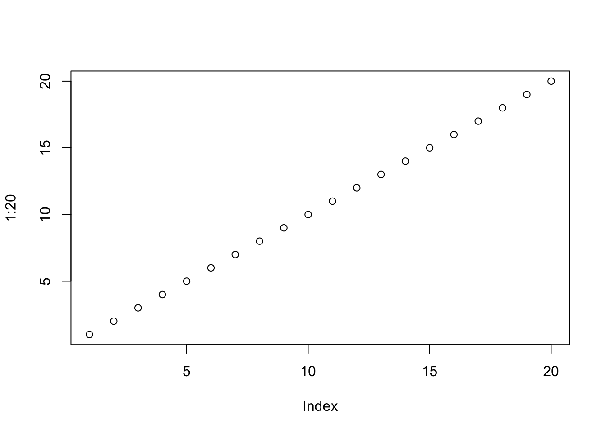

# Introduction

Welcome to my Quarto case study for Week 01. In this report, I will be reviewing articles that use data visualizations to answer questions. Below are the links to the articles:


[The Pudding](https://pudding.cool/)

What is unique or good about the visualization? List a few ideas.

  The visualization stands out due to its exceptional qualities. It boasts a well-chosen font that enhances readability, user-friendly interactive buttons, comprehensive visual representation, and a thoughtfully curated color palette, creating a visually appealing and engaging experience for users.

What could be better? Identify at least one issue with the visualization.

  While the visualization excels in various aspects, there is room for improvement. One noticeable issue is the oversized text, which can be distracting. Additionally, the inconsistency in font styles could be streamlined for a more cohesive look. Moreover, the user interface should provide clearer cues for scrolling, as the current flow may confuse users.


[FiveThirtyEight](https://fivethirtyeight.com/)

What is unique or good about the visualization? List a few ideas.

  The visualization impresses with its effective information spacing, consistent and legible font usage, and an intuitive and visually pleasing navigation system that makes it easy for users to explore the website.


What could be better? Identify at least one issue with the visualization.

  While the visualization has strengths, it could benefit from more visually engaging ways to present information, improved UI interaction design to enhance user experience, and a more appealing color palette than plain black to make it even more impactful and user-friendly.


[Our World in Data](https://ourworldindata.org/)

What is unique or good about the visualization? List a few ideas.

  The website's content is well-organized with optimal spacing for readability.It provides all necessary information, ensuring users can access what they need. The entire page is utilized effectively, and links for navigation are easily accessible, enhancing the user experience.

What could be better? Identify at least one issue with the visualization.

  While the visualization has strengths, one area for improvement is its visual aesthetics. It could benefit from a less rigid, boxy appearance for a more dynamic and engaging design. Additionally, exploring a more appealing color palette and maintaining consistency in font size would enhance its overall presentation.


# Plot 


::: {.cell}

```{.r .cell-code}
plot(1:20)
```

::: {.cell-output-display}
{width=672}
:::
:::