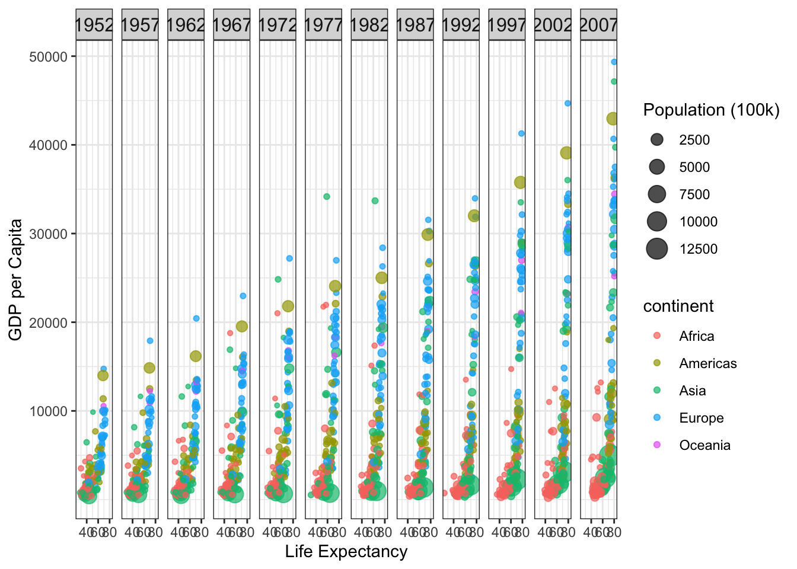

::: {.cell}

```{.r .cell-code}
# Load necessary libraries
library(gapminder)
library(tidyverse)
```

::: {.cell-output .cell-output-stderr}
```
── Attaching core tidyverse packages ──────────────────────── tidyverse 2.0.0 ──
✔ dplyr     1.1.3     ✔ readr     2.1.4
✔ forcats   1.0.0     ✔ stringr   1.5.0
✔ ggplot2   3.4.3     ✔ tibble    3.2.1
✔ lubridate 1.9.2     ✔ tidyr     1.3.0
✔ purrr     1.0.2     
── Conflicts ────────────────────────────────────────── tidyverse_conflicts() ──
✖ dplyr::filter() masks stats::filter()
✖ dplyr::lag()    masks stats::lag()
ℹ Use the conflicted package (<http://conflicted.r-lib.org/>) to force all conflicts to become errors
```
:::

```{.r .cell-code}
library(ggplot2)

# Remove Kuwait from the dataset
gapminder <- gapminder %>% filter(country != "Kuwait")
```
:::

::: {.cell}

```{.r .cell-code}
head(gapminder)
```

::: {.cell-output .cell-output-stdout}
```
# A tibble: 6 × 6
  country     continent  year lifeExp      pop gdpPercap
  <fct>       <fct>     <int>   <dbl>    <int>     <dbl>
1 Afghanistan Asia       1952    28.8  8425333      779.
2 Afghanistan Asia       1957    30.3  9240934      821.
3 Afghanistan Asia       1962    32.0 10267083      853.
4 Afghanistan Asia       1967    34.0 11537966      836.
5 Afghanistan Asia       1972    36.1 13079460      740.
6 Afghanistan Asia       1977    38.4 14880372      786.
```
:::
:::

::: {.cell}

```{.r .cell-code}
# Filter the data for the specified years
data_filtered <- gapminder %>%
  filter(year %in% c(1952, 1957, 1962, 1967, 1972, 1977, 1982, 1987, 1992, 1997, 2002, 2007))
```
:::

::: {.cell}

```{.r .cell-code}
ggplot(data_filtered, aes(x = lifeExp, y = gdpPercap, color = continent, size = pop / 100000)) +
  geom_point(alpha = 0.7) +
  labs(size = "Population (100k)",
       x="Life Expectancy",
       y="GDP per Capita") +
  scale_x_continuous(breaks = c(0, 40, 60, 80)) +
  scale_y_continuous(breaks = seq(10000, 50000, 10000)) +
  theme_bw() +
  facet_grid(. ~ year) +
  theme(strip.text = element_text(size = 12))
```

::: {.cell-output-display}
{width=672}
:::
:::