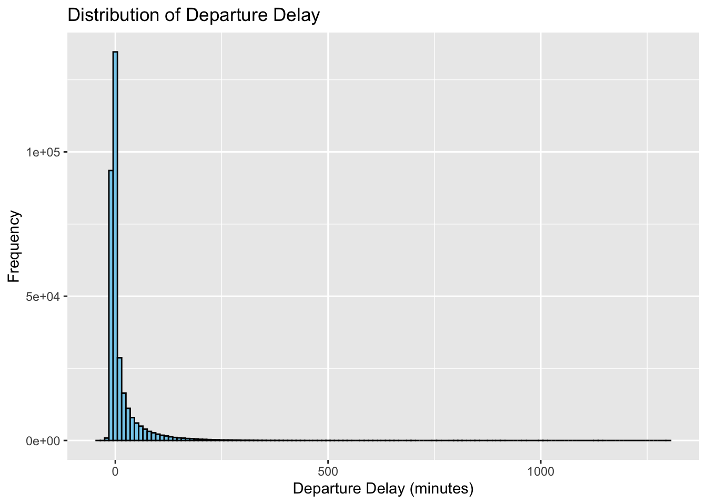
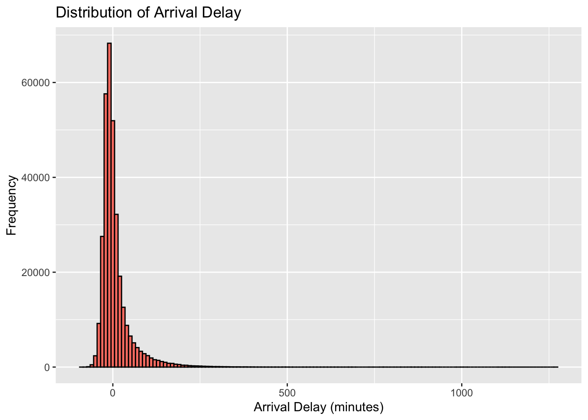
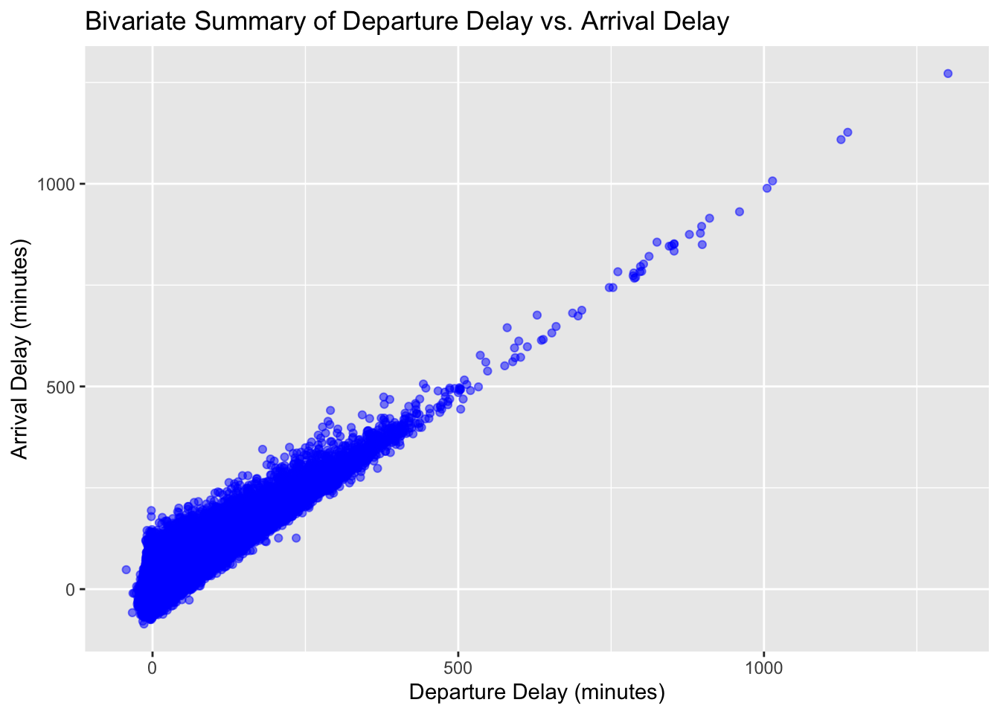

# Task Description

In this task, we will explore and analyze the `nycflights13::flights` dataset using R. To begin, make sure you have the `tidyverse` and `nycflights13` packages installed and loaded.


::: {.cell}

```{.r .cell-code}
# Load the tidyverse package
library(tidyverse)
```

::: {.cell-output .cell-output-stderr}
```
── Attaching core tidyverse packages ──────────────────────── tidyverse 2.0.0 ──
✔ dplyr     1.1.3     ✔ readr     2.1.4
✔ forcats   1.0.0     ✔ stringr   1.5.0
✔ ggplot2   3.4.3     ✔ tibble    3.2.1
✔ lubridate 1.9.2     ✔ tidyr     1.3.0
✔ purrr     1.0.2     
── Conflicts ────────────────────────────────────────── tidyverse_conflicts() ──
✖ dplyr::filter() masks stats::filter()
✖ dplyr::lag()    masks stats::lag()
ℹ Use the conflicted package (<http://conflicted.r-lib.org/>) to force all conflicts to become errors
```
:::
:::

::: {.cell}

```{.r .cell-code}
# Load the nycflights13 package (if not already installed)
# install.packages("nycflights13")

# Load the flights dataset
library(nycflights13)
data(flights)
```
:::

::: {.cell}

```{.r .cell-code}
?nycflights13::flights
```
:::


# Summary Plot

  I arrived at choosing the 'dep_delay' and 'arr_delay' columns then visualized the distribution for Departure Delay and Arrival Delay. In the insights of the Distribution Delay shown the data points closer to 0-1 min and same for Departure Arrival close to 0-1 min. For the 'Bivariate Summary of Departure Delay vs. Arrival Delay' see high cluster of smaller delay to smaller arrival times in minutes.

::: {.cell}

```{.r .cell-code}
variable1 <- "dep_delay"
variable2 <- "arr_delay"


dep_delay_plot <- ggplot(flights, aes(x = dep_delay)) +
  geom_histogram(binwidth = 10, fill = "skyblue", color = "black") +
  labs(title = "Distribution of Departure Delay",
       x = "Departure Delay (minutes)",
       y = "Frequency")

arr_delay_plot <- ggplot(flights, aes(x = arr_delay)) +
  geom_histogram(binwidth = 10, fill = "salmon", color = "black") +
  labs(title = "Distribution of Arrival Delay",
       x = "Arrival Delay (minutes)",
       y = "Frequency")

bivariate_summary_plot <- ggplot(flights, aes(x = dep_delay, y = arr_delay)) +
  geom_point(alpha = 0.5, color = "blue") +
  labs(title = "Bivariate Summary of Departure Delay vs. Arrival Delay",
       x = "Departure Delay (minutes)",
       y = "Arrival Delay (minutes)")


dep_delay_plot
```

::: {.cell-output .cell-output-stderr}
```
Warning: Removed 8255 rows containing non-finite values (`stat_bin()`).
```
:::

::: {.cell-output-display}
{width=672}
:::

```{.r .cell-code}
arr_delay_plot
```

::: {.cell-output .cell-output-stderr}
```
Warning: Removed 9430 rows containing non-finite values (`stat_bin()`).
```
:::

::: {.cell-output-display}
{width=672}
:::

```{.r .cell-code}
bivariate_summary_plot
```

::: {.cell-output .cell-output-stderr}
```
Warning: Removed 9430 rows containing missing values (`geom_point()`).
```
:::

::: {.cell-output-display}
{width=672}
:::
:::
