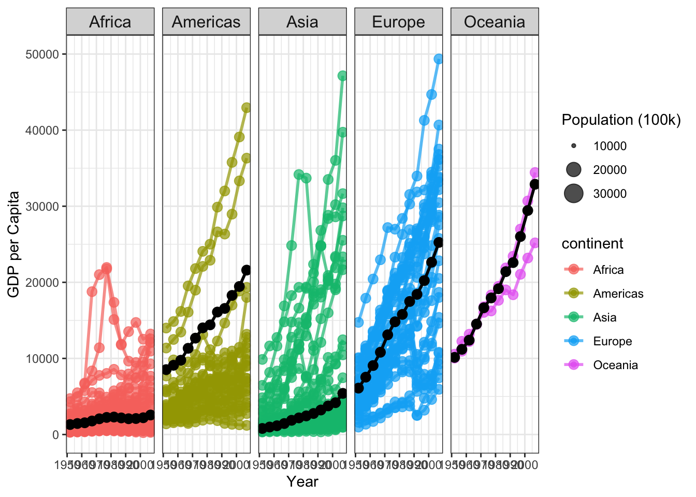

::: {.cell}

```{.r .cell-code}
#install.packages("devtools")
library(gapminder)
library(tidyverse)
```

::: {.cell-output .cell-output-stderr}
```
── Attaching core tidyverse packages ──────────────────────── tidyverse 2.0.0 ──
✔ dplyr     1.1.3     ✔ readr     2.1.4
✔ forcats   1.0.0     ✔ stringr   1.5.0
✔ ggplot2   3.4.3     ✔ tibble    3.2.1
✔ lubridate 1.9.2     ✔ tidyr     1.3.0
✔ purrr     1.0.2     
── Conflicts ────────────────────────────────────────── tidyverse_conflicts() ──
✖ dplyr::filter() masks stats::filter()
✖ dplyr::lag()    masks stats::lag()
ℹ Use the conflicted package (<http://conflicted.r-lib.org/>) to force all conflicts to become errors
```
:::

```{.r .cell-code}
library(ggplot2)
```
:::

::: {.cell}

```{.r .cell-code}
# Remove Kuwait from the dataset
gapminder <- gapminder %>% filter(country != "Kuwait")
```
:::

::: {.cell}

```{.r .cell-code}
head(gapminder)
```

::: {.cell-output .cell-output-stdout}
```
# A tibble: 6 × 6
  country     continent  year lifeExp      pop gdpPercap
  <fct>       <fct>     <int>   <dbl>    <int>     <dbl>
1 Afghanistan Asia       1952    28.8  8425333      779.
2 Afghanistan Asia       1957    30.3  9240934      821.
3 Afghanistan Asia       1962    32.0 10267083      853.
4 Afghanistan Asia       1967    34.0 11537966      836.
5 Afghanistan Asia       1972    36.1 13079460      740.
6 Afghanistan Asia       1977    38.4 14880372      786.
```
:::
:::

::: {.cell}

```{.r .cell-code}
data_filtered <- gapminder %>%
  filter(continent %in% c("Africa", "Americas", "Asia", "Europe", "Oceania"))


weighted_avg_data <- data_filtered %>%
  group_by(year, continent) %>%
  summarise(weighted_gdp = weighted.mean(gdpPercap, w = pop / 100000), .groups = "drop")


ggplot(data_filtered, aes(x = year, y = gdpPercap, color = continent, size = pop / 100000)) +
  geom_point(alpha = 0.7) +
  labs(size = "Population (100k)",
       x = "Year",
       y = "GDP per Capita") +
  scale_x_continuous(breaks = seq(1950, 2000, by = 10)) +
  scale_y_continuous(breaks = seq(0, 50000, by = 10000), limits = c(0, 50000)) +
  theme_bw() +
  facet_wrap(~continent, nrow = 1) +
  theme(strip.text = element_text(size = 12)) +
  

  geom_line(aes(group = interaction(continent, country), color = continent), alpha = 0.7, size = 1) +
  geom_point(aes(group = interaction(continent, country), color = continent), alpha = 0.7, size = 3) +
  

  geom_line(data = weighted_avg_data, aes(group = continent, x = year, y = weighted_gdp), 
            color = "black", size = 1) +
  geom_point(data = weighted_avg_data, aes(group = continent, x = year, y = weighted_gdp), 
             color = "black", size = 3) +
  

  scale_size_continuous(breaks = c(10000, 20000, 30000), labels = c("10000", "20000", "30000"), limits = c(10000, 30000)) +
  

  scale_linewidth(range = c(0.5, 2))  # Adjust the range as needed
```

::: {.cell-output .cell-output-stderr}
```
Warning: Using `size` aesthetic for lines was deprecated in ggplot2 3.4.0.
ℹ Please use `linewidth` instead.
```
:::

::: {.cell-output .cell-output-stderr}
```
Warning: Removed 1684 rows containing missing values (`geom_point()`).
```
:::

::: {.cell-output-display}
{width=672}
:::
:::
