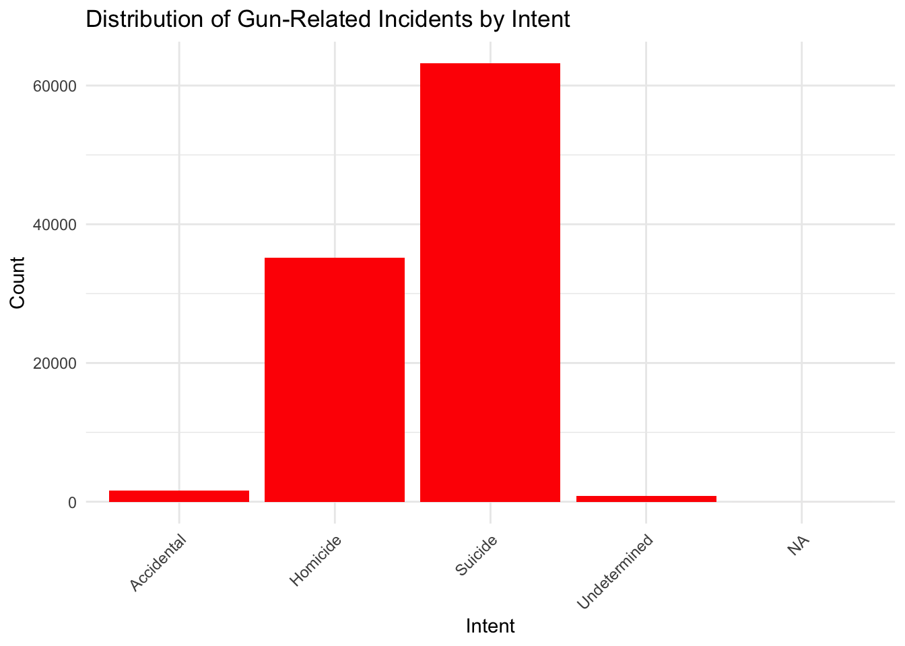
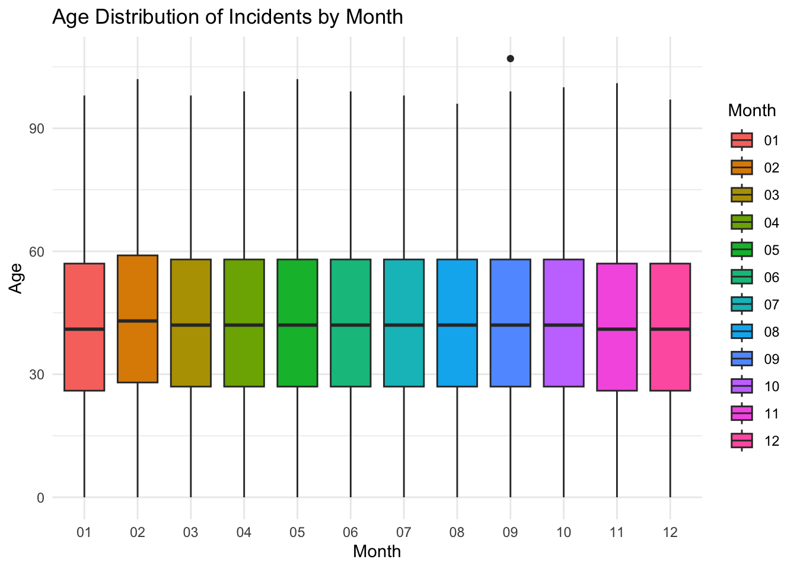
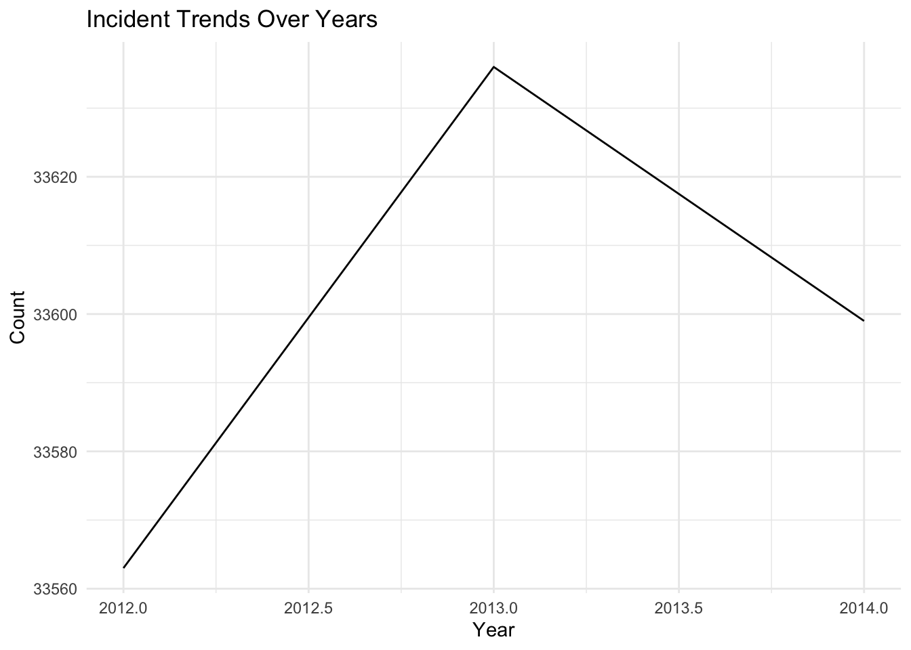

::: {.cell}

```{.r .cell-code}
# Packages

#install.packages("ggplot2")
#install.packages("readr")

library(ggplot2)
library(readr)
```
:::

::: {.cell}

```{.r .cell-code}
# Data

url <- "https://raw.githubusercontent.com/fivethirtyeight/guns-data/master/full_data.csv"

data <- read_csv(url)
```

::: {.cell-output .cell-output-stderr}
```
New names:
Rows: 100798 Columns: 11
── Column specification
──────────────────────────────────────────────────────── Delimiter: "," chr
(6): month, intent, sex, race, place, education dbl (5): ...1, year, police,
age, hispanic
ℹ Use `spec()` to retrieve the full column specification for this data. ℹ
Specify the column types or set `show_col_types = FALSE` to quiet this message.
• `` -> `...1`
```
:::

```{.r .cell-code}
head(data)
```

::: {.cell-output .cell-output-stdout}
```
# A tibble: 6 × 11
   ...1  year month intent  police sex     age race     hispanic place education
  <dbl> <dbl> <chr> <chr>    <dbl> <chr> <dbl> <chr>       <dbl> <chr> <chr>    
1     1  2012 01    Suicide      0 M        34 Asian/P…      100 Home  BA+      
2     2  2012 01    Suicide      0 F        21 White         100 Stre… Some col…
3     3  2012 01    Suicide      0 M        60 White         100 Othe… BA+      
4     4  2012 02    Suicide      0 M        64 White         100 Home  BA+      
5     5  2012 02    Suicide      0 M        31 White         100 Othe… HS/GED   
6     6  2012 02    Suicide      0 M        17 Native …      100 Home  Less tha…
```
:::
:::

::: {.cell}

```{.r .cell-code}
col_names <- colnames(data)
col_names
```

::: {.cell-output .cell-output-stdout}
```
 [1] "...1"      "year"      "month"     "intent"    "police"    "sex"      
 [7] "age"       "race"      "hispanic"  "place"     "education"
```
:::
:::

::: {.cell}

```{.r .cell-code}
str(data)
```

::: {.cell-output .cell-output-stdout}
```
spc_tbl_ [100,798 × 11] (S3: spec_tbl_df/tbl_df/tbl/data.frame)
 $ ...1     : num [1:100798] 1 2 3 4 5 6 7 8 9 10 ...
 $ year     : num [1:100798] 2012 2012 2012 2012 2012 ...
 $ month    : chr [1:100798] "01" "01" "01" "02" ...
 $ intent   : chr [1:100798] "Suicide" "Suicide" "Suicide" "Suicide" ...
 $ police   : num [1:100798] 0 0 0 0 0 0 0 0 0 0 ...
 $ sex      : chr [1:100798] "M" "F" "M" "M" ...
 $ age      : num [1:100798] 34 21 60 64 31 17 48 41 50 NA ...
 $ race     : chr [1:100798] "Asian/Pacific Islander" "White" "White" "White" ...
 $ hispanic : num [1:100798] 100 100 100 100 100 100 100 100 100 998 ...
 $ place    : chr [1:100798] "Home" "Street" "Other specified" "Home" ...
 $ education: chr [1:100798] "BA+" "Some college" "BA+" "BA+" ...
 - attr(*, "spec")=
  .. cols(
  ..   ...1 = col_double(),
  ..   year = col_double(),
  ..   month = col_character(),
  ..   intent = col_character(),
  ..   police = col_double(),
  ..   sex = col_character(),
  ..   age = col_double(),
  ..   race = col_character(),
  ..   hispanic = col_double(),
  ..   place = col_character(),
  ..   education = col_character()
  .. )
 - attr(*, "problems")=<externalptr> 
```
:::
:::

::: {.cell}

```{.r .cell-code}
unique_values <- unique(data$hispanic)

unique_values
```

::: {.cell-output .cell-output-stdout}
```
 [1] 100 998 281 211 261 210 222 282 260 270 231 237 200 223 226 275 250 234 280
[20] 227 224 286 233 271 220 225 235 242 212 221 239 299 232 291 217 252 209 238
[39] 218
```
:::
:::

::: {.cell}

```{.r .cell-code}
unique_values_year <- unique(data$year)

unique_values_year
```

::: {.cell-output .cell-output-stdout}
```
[1] 2012 2013 2014
```
:::
:::


## Summary of Article FiveThirtyEight

  This article is a comprehensive and data-driven exploration of the multifaceted issue of gun-related fatalities in the United States. It delves into critical subtopics, such as the disturbing trends of suicides among middle-aged men, the tragic impact of homicides disproportionately affecting young Black men, and the often-overlooked but significant occurrence of accidental deaths related to firearms. By synthesizing and presenting data from various sources, this project provides valuable insights and a holistic perspective on the complex challenges surrounding gun deaths, contributing to a broader understanding of this pressing societal issue.


## Distribution of Gun-Related Incidents by Intent

Here showing the visualize the distribution of gun-related incidents by intent (e.g., homicide, suicide) using the "intent" column.


::: {.cell}

```{.r .cell-code}
plot <- ggplot(data, aes(x = intent)) +
  geom_bar(fill = "red") +
  labs(title = "Distribution of Gun-Related Incidents by Intent",
       x = "Intent",
       y = "Count") +
  theme_minimal() +
  theme(axis.text.x = element_text(angle = 45, hjust = 1))


print(plot)
```

::: {.cell-output-display}
{width=672}
:::
:::


## Seasonal Distribution of Incidents by Intent:

  This bar plot illustrates the distribution of gun-related incidents by intent (e.g., homicide, suicide) across different seasons. It helps identify whether there are notable variations in incident types during different seasons, allowing the client to tailor their commercials accordingly.


::: {.cell}

```{.r .cell-code}
# Create a seasonal bar plot of incidents by intent


plot1 <- ggplot(data, aes(x = month, fill = intent)) +
  geom_bar(position = "stack") +
  labs(title = "Monthly Distribution of Incidents by Intent",
       x = "Month",
       y = "Count",
       fill = "Intent") +
  theme_minimal()

# Display the plot
print(plot1)
```

::: {.cell-output-display}
{width=672}
:::
:::


## Age Distribution of Incidents by Season:

  This box plot visualizes the age distribution of individuals involved in gun-related incidents for each season. It helps the client understand if certain age groups are more affected during specific seasons.


::: {.cell}

```{.r .cell-code}
plot2 <- ggplot(data, aes(x = month, y = age, fill = month)) +
  geom_boxplot() +
  labs(title = "Age Distribution of Incidents by Month",
       x = "Month",
       y = "Age",
       fill = "Month") +
  theme_minimal()

# Display the plot
print(plot2)
```

::: {.cell-output .cell-output-stderr}
```
Warning: Removed 18 rows containing non-finite values (`stat_boxplot()`).
```
:::

::: {.cell-output-display}
{width=672}
:::
:::


## Incident Trends Over Years:

  This line plot shows the trends in gun-related incidents over the years. By examining year-to-year changes, the client can identify any significant increases or decreases in incidents during specific seasons, helping them plan targeted campaigns.


::: {.cell}

```{.r .cell-code}
plot3 <- ggplot(data, aes(x = year, group = 1)) +
  geom_line(stat = "count") +
  labs(title = "Incident Trends Over Years",
       x = "Year",
       y = "Count") +
  theme_minimal()

# Display the plot
print(plot3)
```

::: {.cell-output-display}
{width=672}
:::
:::
