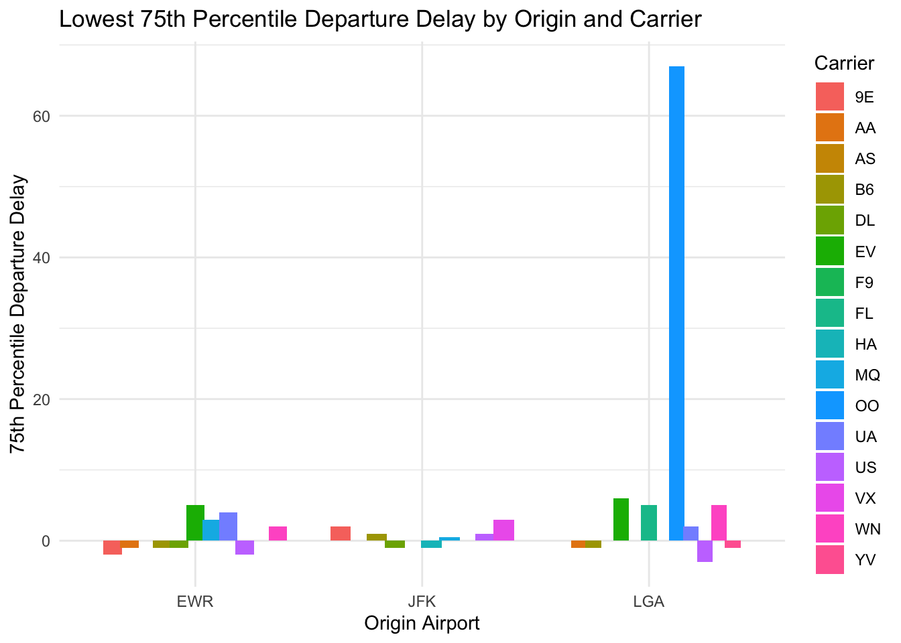
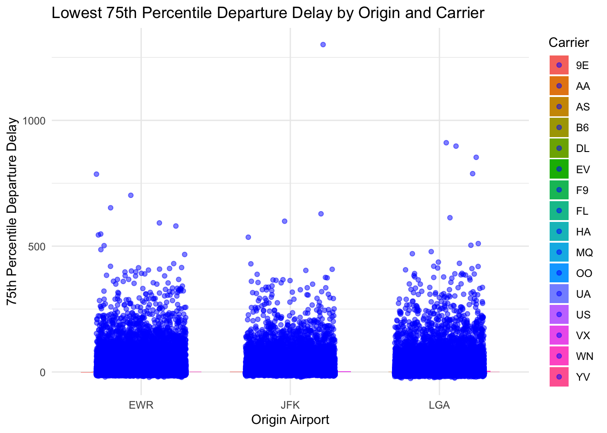
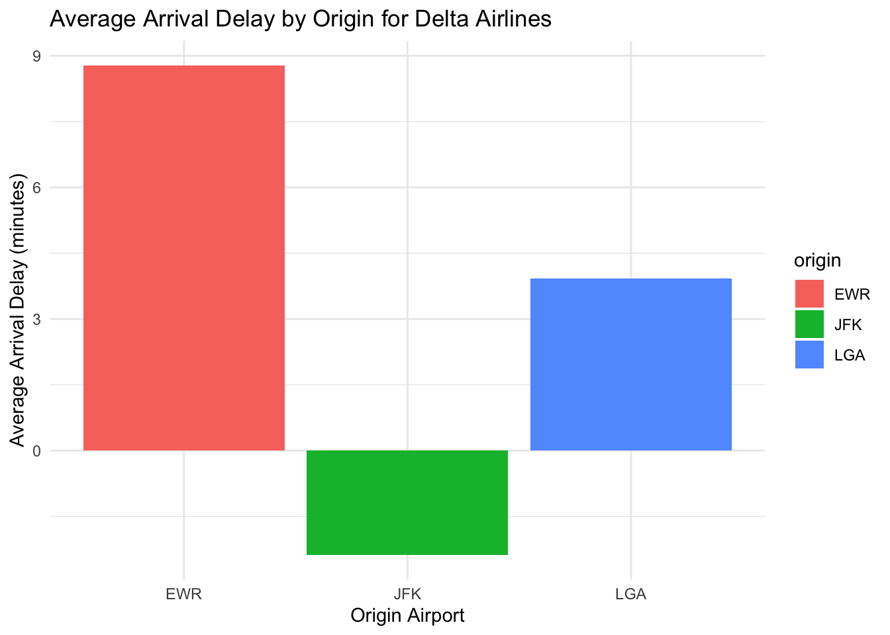

# Import Packages


::: {.cell}

```{.r .cell-code}
#install.packages("nycflights13")


# Load the nycflights13 package
library(nycflights13)
library(dplyr)
```

::: {.cell-output .cell-output-stderr}
```

Attaching package: 'dplyr'
```
:::

::: {.cell-output .cell-output-stderr}
```
The following objects are masked from 'package:stats':

    filter, lag
```
:::

::: {.cell-output .cell-output-stderr}
```
The following objects are masked from 'package:base':

    intersect, setdiff, setequal, union
```
:::

```{.r .cell-code}
library(ggplot2)


data("flights")

head(flights)
```

::: {.cell-output .cell-output-stdout}
```
# A tibble: 6 × 19
   year month   day dep_time sched_dep_time dep_delay arr_time sched_arr_time
  <int> <int> <int>    <int>          <int>     <dbl>    <int>          <int>
1  2013     1     1      517            515         2      830            819
2  2013     1     1      533            529         4      850            830
3  2013     1     1      542            540         2      923            850
4  2013     1     1      544            545        -1     1004           1022
5  2013     1     1      554            600        -6      812            837
6  2013     1     1      554            558        -4      740            728
# ℹ 11 more variables: arr_delay <dbl>, carrier <chr>, flight <int>,
#   tailnum <chr>, origin <chr>, dest <chr>, air_time <dbl>, distance <dbl>,
#   hour <dbl>, minute <dbl>, time_hour <dttm>
```
:::
:::

::: {.cell}

```{.r .cell-code}
colnames(flights)
```

::: {.cell-output .cell-output-stdout}
```
 [1] "year"           "month"          "day"            "dep_time"      
 [5] "sched_dep_time" "dep_delay"      "arr_time"       "sched_arr_time"
 [9] "arr_delay"      "carrier"        "flight"         "tailnum"       
[13] "origin"         "dest"           "air_time"       "distance"      
[17] "hour"           "minute"         "time_hour"     
```
:::
:::


# Question 1

For each origin airport (JFK, EWR, LGA), which airline has the lowest 75th percentile of departure delay for flights scheduled to leave earlier than noon?

In analyzing the flight data, I can identified the airlines with the lowest 75th percentile departure delays for morning flights at each of the key origin airports. Delta Airlines at JFK, US Airways at LGA, and 9E at EWR exhibit the best on-time performance.


::: {.cell}

```{.r .cell-code}
flights_before_noon <- filter(flights, hour < 12)

result <- flights_before_noon %>%
  group_by(origin, carrier) %>%
  summarize(q75_dep_delay = quantile(dep_delay, 0.75, na.rm = TRUE), .groups = "drop") %>%
  ungroup()

min_delay_carrier <- result %>%
  group_by(origin) %>%
  filter(q75_dep_delay == min(q75_dep_delay)) %>%
  ungroup()

min_delay_carrier
```

::: {.cell-output .cell-output-stdout}
```
# A tibble: 5 × 3
  origin carrier q75_dep_delay
  <chr>  <chr>           <dbl>
1 EWR    9E                 -2
2 EWR    US                 -2
3 JFK    DL                 -1
4 JFK    HA                 -1
5 LGA    US                 -3
```
:::
:::

::: {.cell}

```{.r .cell-code}
ggplot(result, aes(x = origin, y = q75_dep_delay, fill = carrier)) +
  geom_bar(stat = "identity", position = position_dodge(width = 0.8)) +
  labs(
    title = "Lowest 75th Percentile Departure Delay by Origin and Carrier",
    x = "Origin Airport",
    y = "75th Percentile Departure Delay",
    fill = "Carrier"
  ) +
  theme_minimal()
```

::: {.cell-output-display}
{width=672}
:::
:::

::: {.cell}

```{.r .cell-code}
flights_before_noon <- filter(flights, hour < 12)


result <- flights_before_noon %>%
  group_by(origin, carrier) %>%
  summarize(q75_dep_delay = quantile(dep_delay, 0.75, na.rm = TRUE), .groups = "drop") %>%
  ungroup()


min_delay_carrier <- result %>%
  group_by(origin) %>%
  filter(q75_dep_delay == min(q75_dep_delay)) %>%
  ungroup()


ggplot(result, aes(x = origin, y = q75_dep_delay, fill = carrier)) +
  geom_bar(stat = "identity", position = position_dodge(width = 0.8)) +
  geom_jitter(data = flights_before_noon, aes(x = origin, y = dep_delay), color = "blue", alpha = 0.5, width = 0.3) +
  labs(
    title = "Lowest 75th Percentile Departure Delay by Origin and Carrier",
    x = "Origin Airport",
    y = "75th Percentile Departure Delay",
    fill = "Carrier"
  ) +
  theme_minimal()
```

::: {.cell-output .cell-output-stderr}
```
Warning: Removed 2079 rows containing missing values (`geom_point()`).
```
:::

::: {.cell-output-display}
{width=672}
:::
:::


# Question 2

Which origin airport is best to minimize my chances of a late arrival when I am using Delta Airlines?

For Delta Airlines, JFK shows as the preferred choice among the origin airports to minimize the likelihood of a late arrival. With an average arrival delay of -2.38 minutes, JFK offers the best performance, ensuring a more punctual travel experience.


::: {.cell}

```{.r .cell-code}
delta_flights <- filter(flights, carrier == "DL")


avg_delay_by_origin <- delta_flights %>%
  group_by(origin) %>%
  summarize(avg_arrival_delay = mean(arr_delay, na.rm = TRUE)) %>%
  ungroup()


best_airport <- avg_delay_by_origin %>%
  filter(avg_arrival_delay == min(avg_arrival_delay))


print(avg_delay_by_origin)
```

::: {.cell-output .cell-output-stdout}
```
# A tibble: 3 × 2
  origin avg_arrival_delay
  <chr>              <dbl>
1 EWR                 8.78
2 JFK                -2.38
3 LGA                 3.93
```
:::
:::

::: {.cell}

```{.r .cell-code}
ggplot(avg_delay_by_origin, aes(x = origin, y = avg_arrival_delay, fill = origin)) +
  geom_bar(stat = "identity", position = position_dodge(width = 0.8)) +
  labs(title = "Average Arrival Delay by Origin for Delta Airlines",
       x = "Origin Airport",
       y = "Average Arrival Delay (minutes)") +
  theme_minimal() +
  scale_fill_discrete()
```

::: {.cell-output-display}
{width=672}
:::
:::
