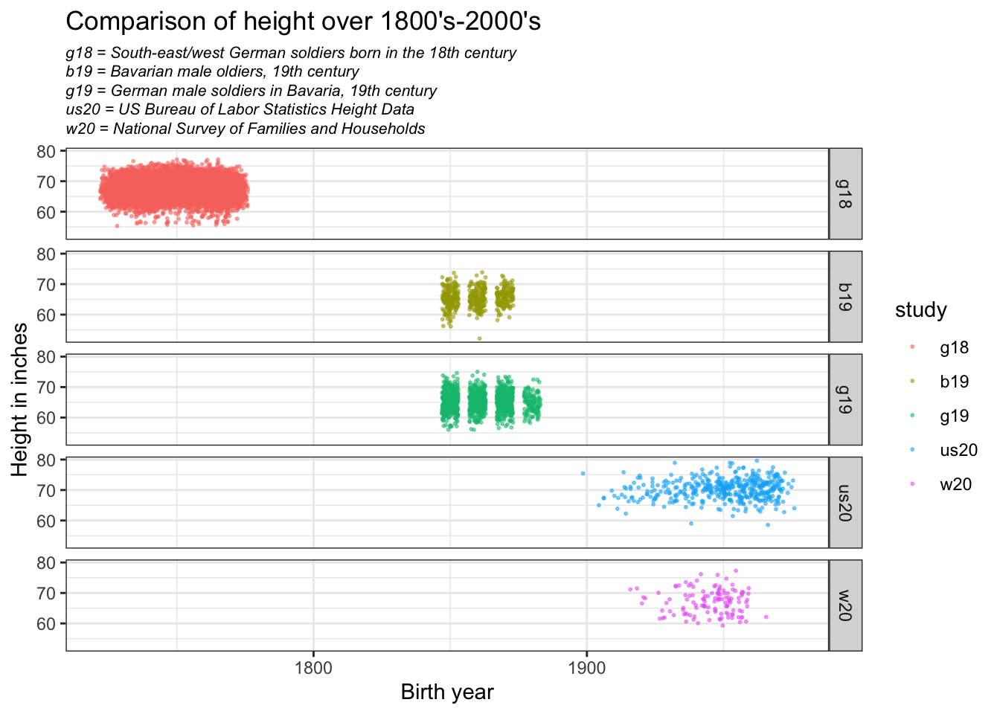

::: {.cell}

```{.r .cell-code}
library(tidyverse)
```

::: {.cell-output .cell-output-stderr}
```
── Attaching core tidyverse packages ──────────────────────── tidyverse 2.0.0 ──
✔ dplyr     1.1.3     ✔ readr     2.1.4
✔ forcats   1.0.0     ✔ stringr   1.5.0
✔ ggplot2   3.4.3     ✔ tibble    3.2.1
✔ lubridate 1.9.2     ✔ tidyr     1.3.0
✔ purrr     1.0.2     
── Conflicts ────────────────────────────────────────── tidyverse_conflicts() ──
✖ dplyr::filter() masks stats::filter()
✖ dplyr::lag()    masks stats::lag()
ℹ Use the conflicted package (<http://conflicted.r-lib.org/>) to force all conflicts to become errors
```
:::

```{.r .cell-code}
library(haven)
library(foreign)
```
:::


## Import Data 


::: {.cell}

```{.r .cell-code}
# german conscr
g_data <- read_dta("https://byuistats.github.io/M335/data/heights/germanconscr.dta")

# german prison
bavarian_data <- read_dta("https://byuistats.github.io/M335/data/heights/germanprison.dta")

zip_url <- "https://byuistats.github.io/M335/data/heights/Heights_south-east.zip"
temp <- tempfile()
download.file(zip_url,temp)
g18raw <- read.dbf(unzip(temp, "B6090.DBF"))
unlink(temp)

# us bureau of labor statistics 20th century
us20raw <- read_csv('https://raw.githubusercontent.com/hadley/r4ds/main/data/heights.csv')
```

::: {.cell-output .cell-output-stderr}
```
Rows: 1192 Columns: 6
── Column specification ────────────────────────────────────────────────────────
Delimiter: ","
chr (2): sex, race
dbl (4): earn, height, ed, age

ℹ Use `spec()` to retrieve the full column specification for this data.
ℹ Specify the column types or set `show_col_types = FALSE` to quiet this message.
```
:::

```{.r .cell-code}
# university of wisconsin national survey data
w20raw <- read_sav('http://www.ssc.wisc.edu/nsfh/wave3/NSFH3%20Apr%202005%20release/main05022005.sav')
```
:::


## German Male Soldiers in 19th century


::: {.cell}

```{.r .cell-code}
g19 <- g_data %>% 
  rename(birth_year = bdec) %>% 
  mutate(study = 'g19') %>% 
  mutate(height.in = height/2.54) %>% 
  select(-c(gebger, co,)) %>% 
  rename(height.cm = height) %>% 
  select(birth_year, height.in, height.cm, study, age)
```
:::


## Bavarian Male Soldiers


::: {.cell}

```{.r .cell-code}
b19 <- bavarian_data %>% 
  rename(birth_year = bdec) %>% 
  mutate(study = 'b19') %>% 
  mutate(height.in = height/2.54) %>% 
  select(-co) %>% 
  rename(height.cm = height) %>% 
  select(birth_year, height.in, height.cm, study, age)
```
:::


## German Soldiers in 18th Century


::: {.cell}

```{.r .cell-code}
g18 <- g18raw %>% 
  select(c(GEBJ, CMETER, SJ)) %>% 
  mutate(study = 'g18') %>% 
  mutate(height.in = CMETER/2.54) %>% 
  rename(birth_year = GEBJ) %>% 
  rename(height.cm = CMETER) %>% 
  mutate(age = SJ - birth_year) %>% 
  select(-SJ) %>% 
  select(birth_year, height.in, height.cm, study, age)
```
:::


## US Bureau of Labor Statistics Height Data


::: {.cell}

```{.r .cell-code}
us20 <- us20raw %>% 
  filter(race == 'white') %>% 
  mutate(birth_year = 1991 - age) %>% 
  mutate(study = 'us20') %>% 
  rename(edu = ed) %>% 
  rename(income = earn) %>% 
  rename(height.in = height) %>% 
  filter(sex == 'male') %>% 
  select(-c(sex, income, edu, race)) %>% 
  mutate(height.cm = height.in*2.54) %>% 
  select(birth_year, height.in, height.cm, study, age)
```
:::


## National Survery of Families and Households


::: {.cell}

```{.r .cell-code}
w20 <- w20raw %>% 
  mutate(birth_year = DOBY + 1900) %>% 
  mutate(age = 2002 - birth_year) %>%  #Wave 3 of NSFH was conducted 2001-2003
  select(c(birth_year, age, RT216F, RT216I, RE35)) %>% 
  filter(RE35 == 1) %>% 
  filter(RT216F >= 0) %>% 
  filter(RT216I >= 0) %>% 
  filter(RT216I <= 12) %>% 
  mutate(height.in = (RT216F*12) + RT216I) %>% 
  mutate(study = 'w20') %>% 
  select(-c(RT216F,RT216I, RE35)) %>% 
  mutate(height.cm = height.in*2.54) %>% 
  select(birth_year, height.in, height.cm, study, age)
```
:::


## Binding Data


::: {.cell}

```{.r .cell-code}
alld <- bind_rows(b19, g18, g19, us20, w20)

alld$study <- factor(alld$study,
              levels = c("g18", "b19", "g19", "us20", "w20"))

alld.2040 <- alld %>% filter(age > 20 & age < 40)
```
:::


## Process

In this data wrangling process conducted in R, various datasets containing historical height information from different sources were imported and cleaned to create a comprehensive and tidy dataset. The process involved renaming columns, converting height measurements to a consistent unit (centimeters), removing unnecessary columns, and calculating missing variables like age. Additionally, careful data exclusion decisions were made, such as filtering for specific age ranges and demographic criteria in some datasets. These steps ensured that the final dataset, named "alld," was ready for analysis, with a consistent structure and relevant variables. A subset of this data, "alld.2040," was also created to focus on individuals aged between 20 and 40 years, providing a refined dataset for specific research inquiries.


## Plot of the five studies containing individual heights distribution across centuries.


::: {.cell}

```{.r .cell-code}
ggplot(alld, aes(y = height.in, x = birth_year, color = study)) + 
  geom_jitter(size = 0.4,
              alpha = 0.5,
              width = 3,
              height = 3,) +
  facet_grid(study~.) +
  theme_bw() +
  theme(plot.subtitle = element_text(lineheight = .5,
                                     size = 8,
                                     face = "italic")) +
  labs(x = "Birth year",
       y = "Height in inches",
       title = "Comparison of height over 1800's-2000's",
       subtitle = "g18 = South-east/west German soldiers born in the 18th century\n
b19 = Bavarian male oldiers, 19th century\n
g19 = German male soldiers in Bavaria, 19th century \n
us20 = US Bureau of Labor Statistics Height Data\n
w20 = National Survey of Families and Households",
  )
```

::: {.cell-output-display}
{width=672}
:::
:::


## Overall 

Interestingly, the data shows some fluctuations in human height trends over time. When comparing the height data from different centuries, there is a noticeable increase, but it's important to note that there are some variations within this overall trend. For example, there appears to be a slight dip in the 19th century, particularly among the German male soldiers, followed by a substantial increase in the 20th century, as seen in the US Bureau of Labor Statistics and National Survey of Families and Households datasets. When comparing height from the earliest available data to the most recent, there is an increase of a few inches, which suggests a general trend of increasing height.


Overall, while there are some fluctuations and limitations in the data, it does seem that human height has, on average, increased over time compared to previous centuries. However, the specific magnitude and statistical significance of this increase should be interpreted with caution due to the aforementioned limitations in the datasets.
