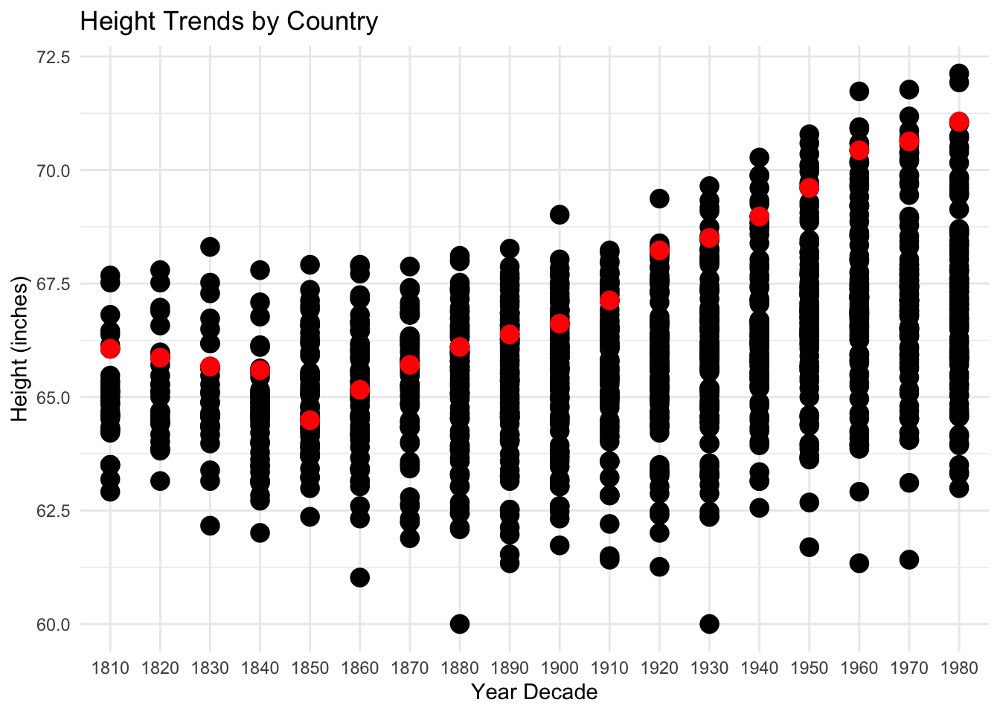

# Import Packages


::: {.cell}

```{.r .cell-code}
library(dplyr)
```

::: {.cell-output .cell-output-stderr}
```

Attaching package: 'dplyr'
```
:::

::: {.cell-output .cell-output-stderr}
```
The following objects are masked from 'package:stats':

    filter, lag
```
:::

::: {.cell-output .cell-output-stderr}
```
The following objects are masked from 'package:base':

    intersect, setdiff, setequal, union
```
:::

```{.r .cell-code}
library(tidyr)
library(ggplot2)
library(readr)
library(stringr)
library(forcats)
library(pander)

# Install and load the readxl package if you haven't already
# install.packages("readxl")
library(readxl)
```
:::

::: {.cell}

```{.r .cell-code}
excel_file <- "/Users/daviedev/DS350_FA23_Pineda_Davi/week_04/Height.xlsx"

data <- read_excel(excel_file)
```
:::

::: {.cell}

```{.r .cell-code}
colnames(data)[colnames(data) == 'Continent, Region, Country'] <- 'country'
```
:::

::: {.cell}

```{.r .cell-code}
pivot_table <- data %>%
  pivot_longer(
    cols = -c(Code, country),
    values_to = "height.cm",
    names_to = "year_decade"
  )
```
:::

::: {.cell}

```{.r .cell-code}
pivot_table <- pivot_table %>% 
  mutate(year_decade = sub("\\.0$", "", year_decade)) %>% 
  mutate(height.cm = round(height.cm, 1)) %>% 
  select(Code, country, height.cm, year_decade)
```
:::

::: {.cell}

```{.r .cell-code}
sorted_pivot_table <- pivot_table %>%
  arrange(year_decade) %>% 
  drop_na()

sorted_pivot_table 
```

::: {.cell-output .cell-output-stdout}
```
# A tibble: 1,330 × 4
    Code country                                           height.cm year_decade
   <dbl> <chr>                                                 <dbl> <chr>      
 1    56 Belgium                                                163. 1810       
 2   280 Federal Republic of Germany (until 1990)               168. 1810       
 3   250 France                                                 164. 1810       
 4   276 Germany                                                168. 1810       
 5   528 Netherlands                                            166  1810       
 6   246 Finland                                                172. 1810       
 7   372 Ireland                                                168  1810       
 8   578 Norway                                                 169. 1810       
 9   826 United Kingdom of Great Britain and Northern Ire…      170. 1810       
10   191 Croatia                                                163. 1810       
# ℹ 1,320 more rows
```
:::
:::

::: {.cell}

```{.r .cell-code}
df <- sorted_pivot_table  %>%
  mutate(height.inches = height.cm / 2.54)
```
:::

::: {.cell}

```{.r .cell-code}
plot <- ggplot(df, aes(x = year_decade, y = height.inches),color= country) +
  geom_point(color="black", size=4) +
  geom_point(data=subset(df, country=="Germany"),color="red",size = 4) +
  labs(x = "Year Decade", y = "Height (inches)", title = "Height Trends by Country") +
  theme_minimal() 
  #scale_color_manual(values = c("other" = "black","Germany" = "red")) 
  #guides(color = guide_legend(order = 1))

plot
```

::: {.cell-output-display}
{width=672}
:::
:::


# Summary 

Based on the available data, it does appear that humans have been getting taller over the years. The data, particularly the trend observed in Germany's growth from 1810 to 1980, suggests a consistent increase in height. It's important to note that this conclusion is based on the specific data set and time frame analyzed, and a comprehensive study would require a more extensive examination of global trends in human height over a longer period.

